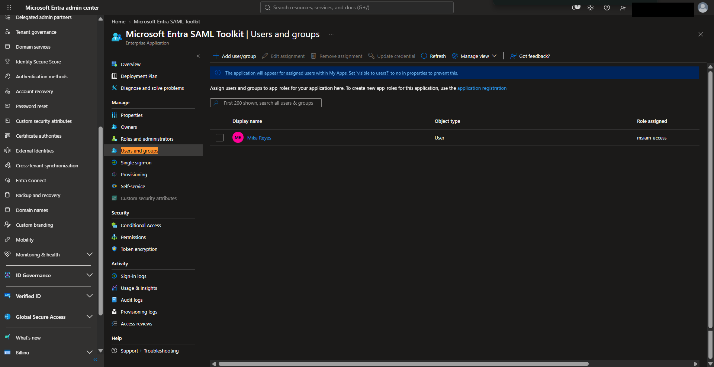
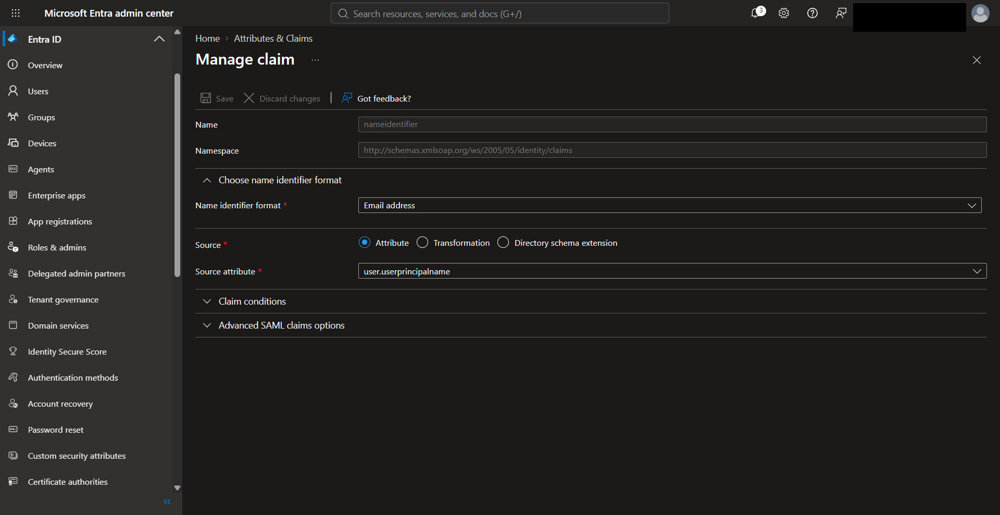
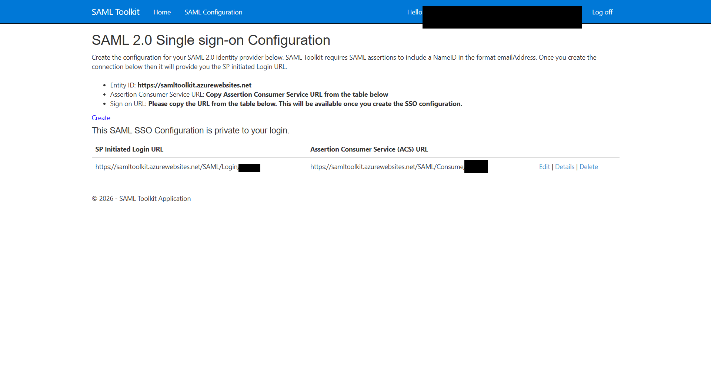
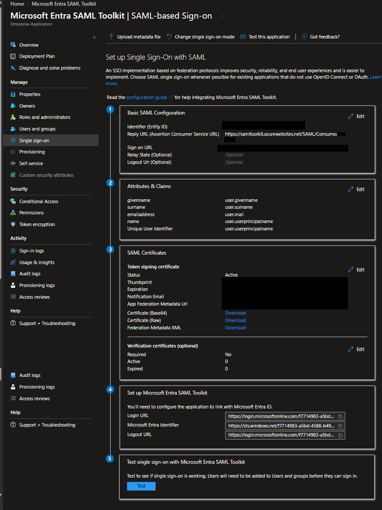
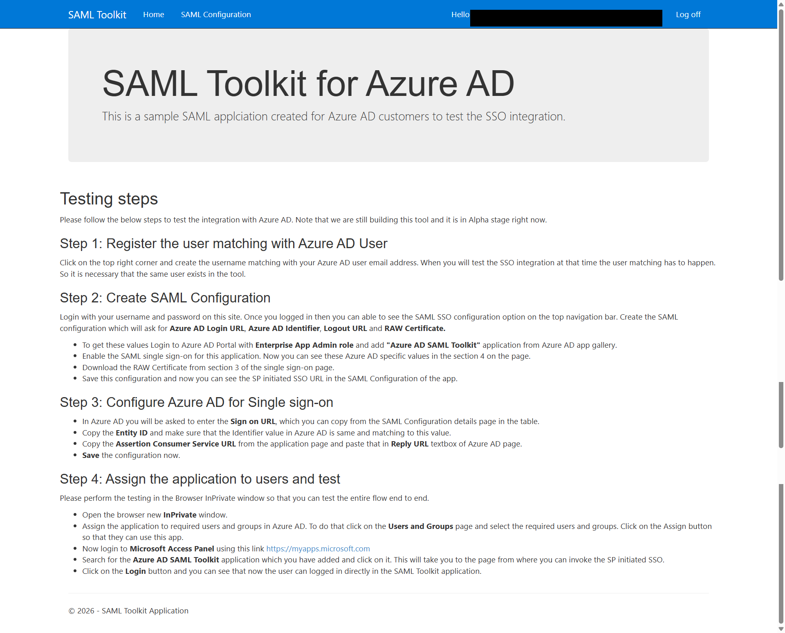
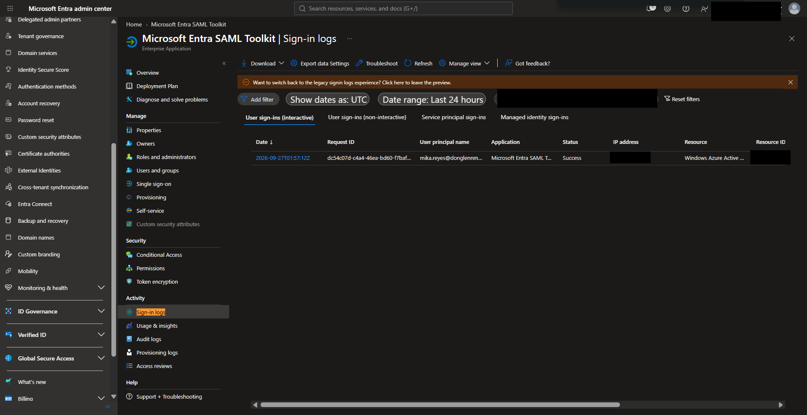
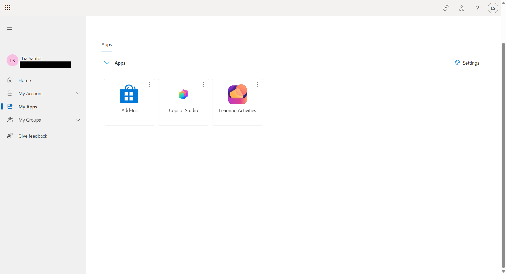

# Microsoft Entra ID SAML SSO Federation Lab

Hands-on IAM project demonstrating SAML 2.0 Single Sign-On federation between Microsoft Entra ID and the Microsoft Entra SAML Toolkit.

---

## Project Objectives

- Configure SAML 2.0 SSO
- Assign an authorized user
- Configure NameID and claims
- Configure SP endpoints
- Establish federation trust
- Test successful SSO
- Verify Entra sign-in logs
- Compare assigned and unassigned user visibility

---

# 1. Enterprise Application User Assignment

Mika Reyes was assigned to the **Microsoft Entra SAML Toolkit** enterprise application.

**Evidence:** Mika is the assigned user for the enterprise application.

---

# 2. SAML NameID Mapping

The SAML NameID was configured using the Microsoft Entra User Principal Name.

- **Format:** Email address
- **Source:** Attribute
- **Source attribute:** `user.userprincipalname`

**Evidence:** Microsoft Entra uses the UPN to identify the user to the Service Provider.

---

# 3. Service Provider Endpoints

The SAML Toolkit generated the endpoints required for federation:

- **SP Initiated Login URL**
- **Assertion Consumer Service (ACS) URL**

**Evidence:** The Service Provider supplied the exact login and ACS endpoints required by Microsoft Entra.

---

# 4. Final SAML Federation Configuration

The Service Provider endpoints were added to Microsoft Entra.

The configuration included:

- Entity ID
- Reply URL / ACS
- Sign-on URL
- Claims
- Token signing certificate

**Evidence:** Microsoft Entra and the Service Provider were configured with matching federation information.

---

# 5. Successful SAML SSO Test

Mika launched the assigned application through Microsoft My Apps.

**Authentication flow:**

Mika → SAML Toolkit → Microsoft Entra ID → Signed SAML Assertion → ACS → SAML Toolkit → Authenticated Session

**Evidence:** Mika successfully reached an authenticated SAML Toolkit session using SSO.

---

# 6. Microsoft Entra Sign-in Log Verification

Microsoft Entra sign-in logs were reviewed after the SSO test.

The Microsoft Entra SAML Toolkit sign-in showed:

**Status: Success**

**Evidence:** Microsoft Entra recorded the successful application authentication event.

---

# 7. Unassigned User Visibility Test

Lia Santos was not assigned to the Microsoft Entra SAML Toolkit application.

After signing in to Microsoft My Apps, the SAML Toolkit was not displayed in her application dashboard.

**Evidence:** The assigned and unassigned users had different application visibility in My Apps.

This test demonstrates application visibility. Direct SAML URL access denial was not separately tested.

---

## Skills Demonstrated

- Microsoft Entra ID
- SAML 2.0
- Single Sign-On
- Identity Federation
- Enterprise Applications
- User Assignment
- NameID Mapping
- SAML Claims
- Signing Certificates
- SP Initiated SSO
- Assertion Consumer Service
- Sign-in Log Validation
- IAM Troubleshooting

---

## Result

Successfully configured and validated SAML 2.0 SSO between Microsoft Entra ID and a Service Provider.

**Workflow:**

User Assignment → NameID Mapping → SP Endpoints → Federation Configuration → Successful SSO → Sign-in Log Validation → Unassigned User Comparison
